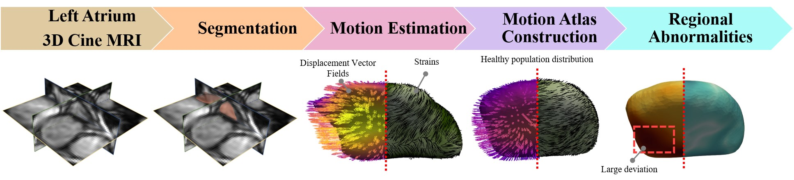

# Aladdin: High-Resolution Maps of Left Atrial Displacements and Strains Estimated with 3D CINE MRI

This repository is the source code for Aladdin. Details on the workflow can be found here: https://arxiv.org/abs/2312.09387

Source code and file descriptions can be found in the subdirectory: https://github.com/cgalaz01/aladdin_cmr_la/tree/main/src

Supplementary figures of the paper can be found in the subdirectory: https://github.com/cgalaz01/aladdin_cmr_la/tree/main/supplements



This is a complete motion analysis workflow (displacement and strains) of the left atrium (LA) using 3D Cine MRI scans. This aim is to identify regional motion abnormalities that can be attributed to an underlying condition. 

The workflow consists of:
* Online few-shot segmentation network to identify the contour of the LA across the whole cardiac cycle
* Online image registration network to estimate the displacement vector fields (DVFs)
* Strain calculation from the DVFs
* Strain and DVFs atlas construction
* Regional abnormality detection from the atlas distribution

## Setup
To download the code to your local repository, we suggest using Git:
```shell
git clone https://github.com/cgalaz01/aladdin_cmr_la.git
```

The code is implemented in Python and all libraries and their versions can be found in the file 'environment.yml'. To setup the environment we suggest using Anaconda.
To install with Anaconda:
```shell
# Navigate to the root directory
cd aladdin_cmr_la
# To create a new conda environment and install all dependencies:
conda env create -f environment.yml
# Now activate the environment
conda activate aladdin
```

## Data	
The data and atlas are available at: https://zenodo.org/records/13645121

To easiest way to include the data in the repository at the expected directories is by running the following command in the root:
```shell
python get_data.py
```

The expected location of the data is:
```
aladdin_cmr_la/data/train
```
where each subject's data is located in its own subfolder. The only folder naming constraint is that patients with a known pathology should have a suffix of 'PAT' so they are not included in the atlas construction. Within each patient subfolder, there should be two more folders, 'images' and 'segmentations' which contain the left atrium images and segmentations respectively.
The following is an example folder structure:
```
aladdin_cmr_la/
└── data/
	└── train/
		├── HLTH01/
		│	├── images/
		│	│	├── 00.nii.gz
		│	│	├── ...
		│	│	└── 19.nii.gz
		│	└── segmentations/
		│		├── 00.nii.gz
		│		├── ...
		│		└── 19.nii.gz
		└── PAT01/
			├── images/
			│	├── 00.nii.gz
			│	├── ...
			│	└── 19.nii.gz
			└── segmentations/
				├── 00.nii.gz
				├── ...
				└── 19.nii.gz
```

From the downloaded data:
- aladdin_cmr_la/data contains the images and segmentation maps.
- aladdin_cmr_la/data_nn contains the images and nnU-Net predicted segmentation maps.
- aladdin_cmr_la/src/atlas_construction/_atlas_output contains the structural atlas used to register a case to.
- aladdin_cmr_la/src/atlas_construction/_atlas_stats_output contains the healthy population's average displacement vector fields (DVFs) and prinicpal strains (Epr) used to calculate the Mahalanobis distance between an individual case and the atlas.
			
## Running nnU-Net (Segmentation network)
To train nnU-Net follow the instructionas at: https://github.com/MIC-DKFZ/nnUNet.

The online-learning variant is simply achieved by converting each case to a separate dataset. The fold split is changed to train on cardiac phases 0, 8 and 15 and validate on the remaining cases.


## Running Aladdin-R (Image registration network)
To train Aladdin-R and generate the predicted displacement vector fields, simply run the following commands:
```shell
cd src
python run_training.py
```

It is expected that the segmentations of all phases are available for training in the data folder.

The best weights per patient will be stored in the folder:
```
aladdin_cmr_la/checkpoint/aladdin_r_<date_time>/<patient>/
```
Similarly, the predicted displacement vector fields across the whole cardiac cycle will be saved in the folder:
```
aladdin_cmr_la/outputs_aladdin_r_<date_time>_nifti/displacement_field/<patient>/full/
```
or just on the non-dilated contour:
```
aladdin_cmr_la/outputs_aladdin_r_<date_time>_nifti/displacement_field/<patient>/contour/
```
The transformed non-dilated contours are also saved:
```
aladdin_cmr_la/outputs_aladdin_r_<date_time>_nifti/segmentation/<patient>/contour/
```

## Running atlas construction
For the atlas construction, it is expected that in the data folder, the images, segmentations and displacements for all cardiac phases are present (outputs from Aladdin-S and Aladdin-R):
```
aladdin_cmr_la/
└── data/
	└── train/
		└── <patient>/
			├── images/
			├── segmentations/
			└── displacements/
				└── full/
```
					
To construct a new atlas, we execute the following commands:
```shell
cd src/atlas_construction
python atlas_generation.py		# Constructs the structure of the atlas from the healthy participants
python register_to_atlas.py		# Calculates the strains and maps the displacement and strain values to the atlas
python atlas_stats.py 			# Obtains the distribution of the displacement and strain values of healthy participants mapped to the atlas
python registration_stats.py		# Calculates the Mahalanobis distance of each case to the atlas' distribution of displacement and strain values
```

The relevant results will be stored in the folder:
```
aladdin_cmr_la/src/atlas_construction/_atlas_output/
```

## Citation
If you found this code useful for your project please cite as:
```
@misc{galazis2023highresolution,
      title={High-Resolution Maps of Left Atrial Displacements and Strains Estimated with 3D CINE MRI and Unsupervised Neural Networks}, 
      author={Christoforos Galazis and Samuel Shepperd and Emma Brouwer and Sandro Queirós and Ebraham Alskaf and Mustafa Anjari and Amedeo Chiribiri and Jack Lee and Anil A. Bharath and Marta Varela},
      year={2023},
      eprint={2312.09387},
      archivePrefix={arXiv},
      primaryClass={cs.CV}
}
```
	
## Acknowledgement
This project was supported by the UK Research and Innovation (UKRI) Centres of Doctoral Training (CDT) in Artificial Intelligence for Healthcare (AI4H) http://ai4health.io (Grant No. EP/S023283/1), the NIHR Imperial Biomedical Research Centre (BRC), and the British Heart Foundation Centre of Research Excellence at Imperial College London (RE/18/4/34215).
