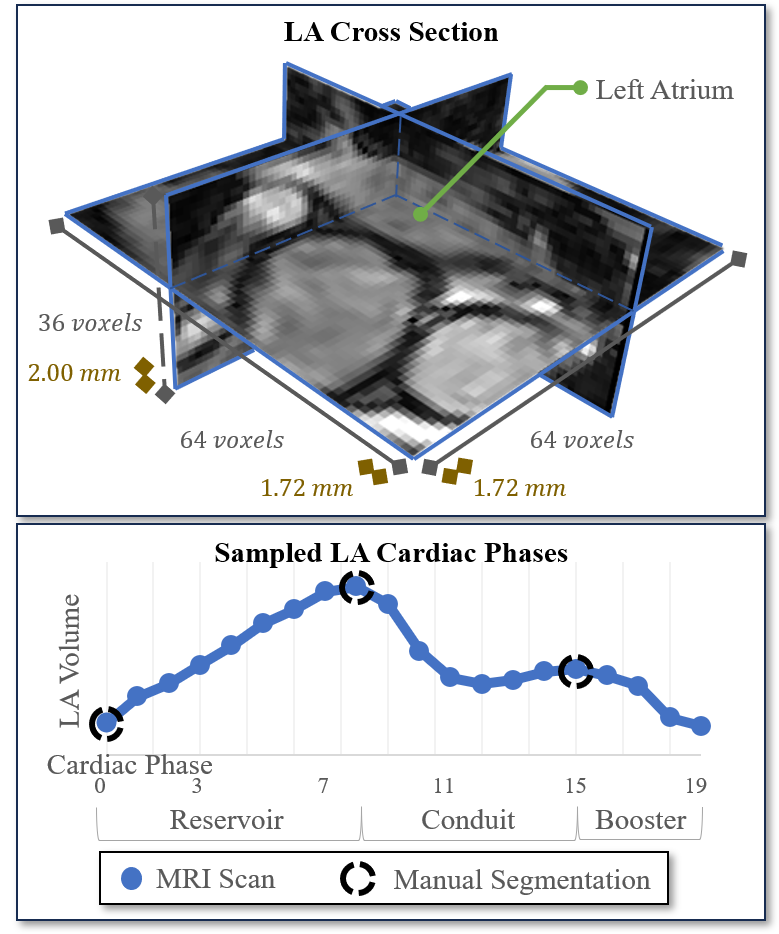
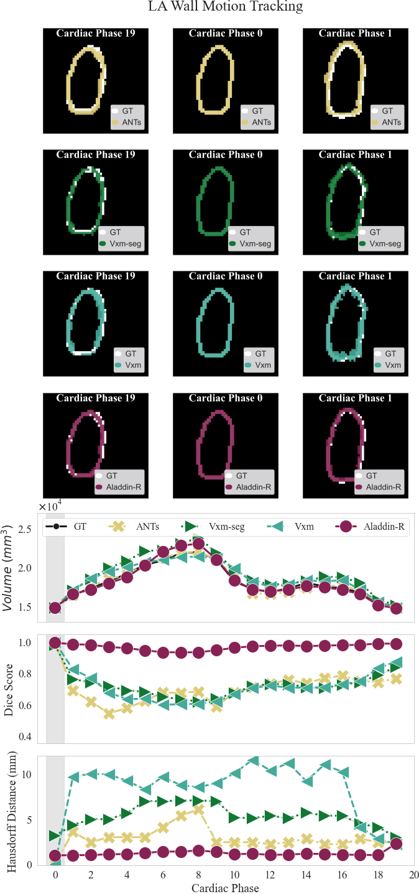
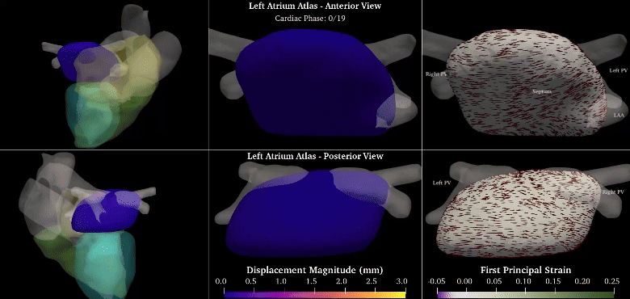
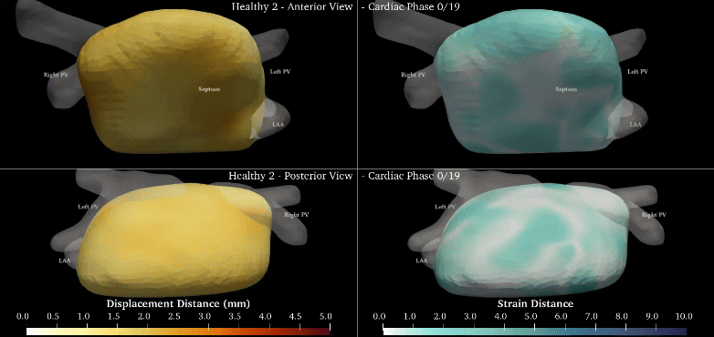
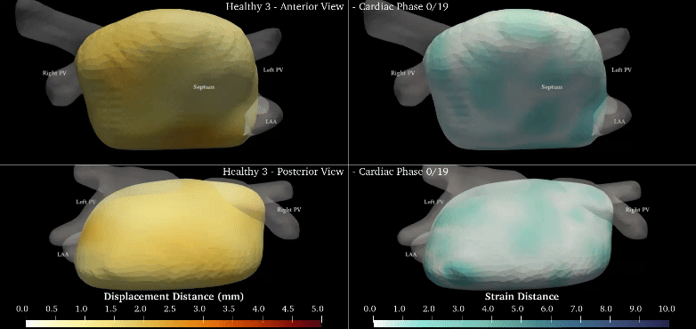
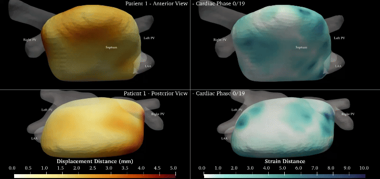
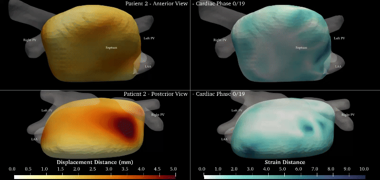
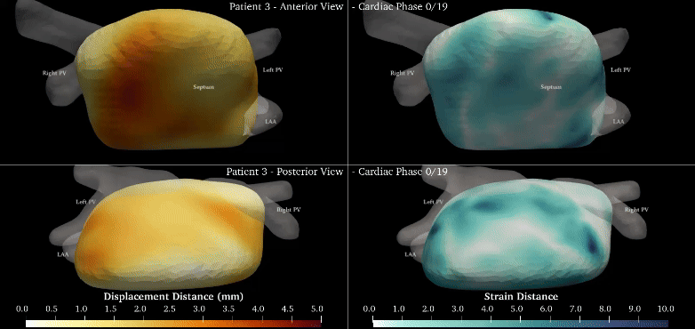

# Supplements

## Data Example
|  | 
|:--:|
| _SupFig 1._ The cross-sectional view of the left atrium (LA) (top) and the volume across the cardiac cycle (bottom) of a representative healthy case (26M), acquired using the proposed high-resolution 3D CINE MRI protocol. |

|  | 
|:--:|
| _SupAni 1._ Slice view of the left atrium of a volunteer (26M) acquired using the proposed high-resolution 3D CINE MRI protocol. |

|  | 
|:--:|
| _SupAni 2._ Slice view of the left atrium of a volunteer (24F) acquired using the proposed high-resolution 3D CINE MRI protocol. |

## Registration Results
|  | 
|:--:|
| _SupAni 3._ The image registration results across the cardiac cycle for a representative case are shown. Each row displays a slice of the resulting registration for the models: ANTs, Vxm-seg, Vxm, and Aladdin-R, respectively. The plots illustrate the volume, Dice score, and Hausdorff distance achieved by each of the models. |

|  | 
|:--:|
| _SupAni 4._ Comparison of the estimated displacement vector fields achieved of a healthy case (26M), from left to right, by Aladdin-R, ANTs, Vxm, and Vxm-seg, respectively, across the cardiac cycle. |

|  | 
|:--:|
| _SupAni 5._ Comparison of the estimated displacement vector fields achieved of a patient case (52F with myocarditis), from left to right, by Aladdin-R, ANTs, Vxm, and Vxm-seg, respectively, across the cardiac cycle. |

## Atlas
|  | 
|:--:|
| _SupAni 6._ Overview of the constructed atlas from the available healthy population. The columns depict the whole heart view, the left atrium displacement vector field, and the first principal strain. The anterior and posterior views are shown in the first and second rows, respectively. |

|  | 
|:--:|
| _SupAni 7._ The Mahalanobis distance of a healthy case (26M) from the atlas across the cardiac cycle. The first column shows the distance of the displacement vector field, and the second column shows the distance of the first principal strain. The anterior and posterior views are shown in rows 1 and 2, respectively. |

|  | 
|:--:|
| _SupAni 8._ The Mahalanobis distance of a healthy case (22F) from the atlas across the cardiac cycle. The first column shows the distance of the displacement vector field, and the second column shows the distance of the first principal strain. The anterior and posterior views are shown in rows 1 and 2, respectively. |

|  | 
|:--:|
| _SupAni 9._ The Mahalanobis distance of a healthy case (24F) from the atlas across the cardiac cycle. The first column shows the distance of the displacement vector field, and the second column shows the distance of the first principal strain. The anterior and posterior views are shown in rows 1 and 2, respectively. |

|  | 
|:--:|
| _SupAni 10._ The Mahalanobis distance of a patient case (52F with myocarditis) from the atlas across the cardiac cycle. The first column shows the distance of the displacement vector field, and the second column shows the distance of the first principal strain. The anterior and posterior views are shown in rows 1 and 2, respectively. |

|  | 
|:--:|
| _SupAni 11._ The Mahalanobis distance of a patient case (60M with myocardial infarction) from the atlas across the cardiac cycle. The first column shows the distance of the displacement vector field, and the second column shows the distance of the first principal strain. The anterior and posterior views are shown in rows 1 and 2, respectively. |

|  | 
|:--:|
| _SupAni 12._ The Mahalanobis distance of a patient case (57F with non-ischaemic cardiomyopathy) from the atlas across the cardiac cycle. The first column shows the distance of the displacement vector field, and the second column shows the distance of the first principal strain. The anterior and posterior views are shown in rows 1 and 2, respectively. |
