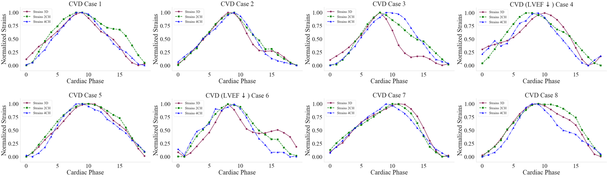

# Supplements

## Data Example
| Supplementary Figure 1 |
|:--:|
|  | 
| _SupFig. 1_ The cross-sectional view of the left atrium (LA) (top) and the volume across the cardiac cycle (bottom) of a representative healthy case (26M), acquired using the proposed high-resolution 3D Cine MRI protocol. |

| Supplementary Video 1 |
|:--:|
|  | 
| _SupVid. 1_ Slice view of the left atrium of a volunteer (26M) acquired using the proposed high-resolution 3D Cine MRI protocol. |

| Supplementary Video 2 |
|:--:|
|  |
| _SupVid. 2_ Slice view of the left atrium of a volunteer (24F) acquired using the proposed high-resolution 3D Cine MRI protocol. |

## Segmentation Results
| Supplementary Video 3 |
|:--:|
|  |
| _SupVid. 3_ The segmentation results across the cardiac cycle for a representative healthy case (26M) is shown. On the left, the estimated segmentation map in a single-slice view, and, on the right, the Dice score and Hausdorff distance.

| Supplementary Video 4 |
|:--:|
|  | 
| _SupVid. 4_ The segmentation results across the cardiac cycle for a representative patient case (52F with myocarditis) is shown. On the left, the estimated segmentation map in a single-slice view, and, on the right, the Dice score and Hausdorff distance.

## Registration Results
| Supplementary Video 5 |
|:--:|
|  | 
| _SupVid. 5_ The image registration results across the cardiac cycle for a representative case is shown. Each row displays a slice of the resulting registration for the models: ANTs, Vxm-seg, Vxm, and Aladdin-R, respectively. The plots illustrate the volume, Dice score, and Hausdorff distance achieved by each of the models. |

| Supplementary Video 6 |
|:--:|
|  | 
| _SupVid. 6_ Comparison of the estimated displacement vector fields achieved of a healthy case (26M), from left to right, by Aladdin-R, ANTs, Vxm, and Vxm-seg, respectively, across the cardiac cycle. |

| Supplementary Video 7 |
|:--:|
|  | 
| _SupVid. 7_ Comparison of the estimated displacement vector fields achieved of a patient case (52F with myocarditis), from left to right, by Aladdin-R, ANTs, Vxm, and Vxm-seg, respectively, across the cardiac cycle. |

| Supplementary Video 8 |
|:--:|
|  | 
| _SupVid. 8_ The displacement vector fields and first principal strain values across the carduac cycle for a representative case. |

## Global Results
| Supplementary Figure 2 |
|:--:|
|  |
| _SupFig. 2_ The normalized volume, displacement magnitude, and strains across the cardiac cycle, plotted separately for each case is shown. For each case, the following details are provided: age, sex, condition, minimum volume, maximum volume, pre-activation volume, ejection fraction (EF), and active ejection fraction (aEF) calculated from the 3D images. |

_SupTab. 1_ Patient metrics including left atrial volume (LAV), left ventricular ejection fraction (LVEF), left atrial active ejection fraction (LAaEF), and left atrial ejection fraction (LAEF), as estimated from the 2-chamber (2CH), 4-chamber (4CH), and 3D views.
| Case | Sex | Age (years) | Condition                    | LAV (cm2) | LVEF (%) | LAaEF 2CH (%) | LAEF 2CH (%) | LAaEF 4CH (%) | LAEF 4CH (%) | LAaEF 2/4CH (%) | LAEF 2/4CH (%) | LAaEF 3D (%) | LAEF 3D (%) |
|------|-----|-------------|------------------------------|-----------|----------|---------------|--------------|---------------|--------------|-----------------|----------------|--------------|-------------|
| P1   | F   | 52          | Myocarditis                  | 21        | 47       | 45.2          | 55.6         | 32.5          | 52.8         | 39.6            | 54.8           | 23.4         | 43.7        |
| P2   | F   | 26          | History of syncope           | 18        | 58       | 40.2          | 67.7         | 39.0          | 65.8         | 44.5            | 67.6           | 26.5         | 56.2        |
| P3   | M   | 35          | History of syncope           | 25        | 58       | 44.1          | 59.2         | 26.1          | 61.9         | 33.2            | 58.5           | 20.6         | 46.9        |
| P4   | M   | 60          | Myocardial infraction        | 17        | 22       | 46.0          | 58.0         | 37.6          | 60.7         | 36.9            | 53.9           | 20.1         | 39.1        |
| P5   | F   | 57          | Non-Ischaemic cardiomyopathy | 19        | 51       | 39.3          | 56.9         | 37.7          | 53.7         | 47.8            | 57.5           | 30.1         | 44.5        |
| P6   | M   | 55          | Myocardial infraction        | 24        | 35       | 36.4          | 41.3         | 22.8          | 39.1         | 32.3            | 40.5           | 15.3         | 26.1        |
| P7   | F   | 66          | Hypertrophic cardiomyopathy  | 21        | 60       | 43.8          | 59.0         | 52.0          | 64.4         | 41.8            | 57.7           | 34.6         | 48.4        |
| P8   | F   | 79          | Myocardial infraction        | 23        | 62       | 45.9          | 55.3         | 39.8          | 65.3         | 37.6            | 57.6           | 35.3         | 48.0        |

| Supplementary Figure 3 |
|:--:|
|  |
| _SupFig. 3_ The correlation matrix between the left atrial volume (LAV), left ventricular ejection fraction (LVEF), left atrial active ejection fraction (LAaEF), and left atrial ejection fraction (LAEF), as estimated from the 2-chamber (2CH), 4-chamber (4CH), and 3D views. |

| Supplementary Figure 4 |
|:--:|
|  |
| _SupFig. 4_ Comparison between the normalized global longitudinal strains from the 2-chamber and 4-chamber, and the mean principal strain values from the 3D view. |

## Regional Results (Atlas-based)
| Supplementary Video 9 |
|:--:|
|  |
| _SupVid. 9_ Overview of the constructed atlas from the available healthy population. The columns depict the whole heart view, the left atrium displacement vector field, and the first principal strain. The anterior and posterior views are shown in the first and second rows, respectively. |

| Supplementary Video 10 |
|:--:|
|  | 
| _SupVid. 10_ The Mahalanobis distance of a healthy case (26M) from the atlas across the cardiac cycle. The first column shows the distance of the displacement vector field, and the second column shows the distance of the first principal strain. The anterior and posterior views are shown in rows 1 and 2, respectively. |

| Supplementary Video 11 |
|:--:|
|  |
| _SupVid. 11_ The Mahalanobis distance of a healthy case (22F) from the atlas across the cardiac cycle. The first column shows the distance of the displacement vector field, and the second column shows the distance of the first principal strain. The anterior and posterior views are shown in rows 1 and 2, respectively. |

| Supplementary Video 12 |
|:--:|
|  |
| _SupVid. 12_ The Mahalanobis distance of a healthy case (24F) from the atlas across the cardiac cycle. The first column shows the distance of the displacement vector field, and the second column shows the distance of the first principal strain. The anterior and posterior views are shown in rows 1 and 2, respectively. |

| Supplementary Video 13 |
|:--:|
|  |
| _SupVid. 13_ The Mahalanobis distance of a patient case (52F with myocarditis) from the atlas across the cardiac cycle. The first column shows the distance of the displacement vector field, and the second column shows the distance of the first principal strain. The anterior and posterior views are shown in rows 1 and 2, respectively. |

| Supplementary Video 14 |
|:--:|
|  |
| _SupVid. 14_ The Mahalanobis distance of a patient case (60M with myocardial infarction) from the atlas across the cardiac cycle. The first column shows the distance of the displacement vector field, and the second column shows the distance of the first principal strain. The anterior and posterior views are shown in rows 1 and 2, respectively. |

| Supplementary Video 15 |
|:--:|
|  |
| _SupVid. 15_ The Mahalanobis distance of a patient case (57F with non-ischaemic cardiomyopathy) from the atlas across the cardiac cycle. The first column shows the distance of the displacement vector field, and the second column shows the distance of the first principal strain. The anterior and posterior views are shown in rows 1 and 2, respectively. |

| Supplementary Video 16 |
|:--:|
|  | 
| _SupVid. 16_ The displacement vector fields and first principal strains of a healthy case (26M) mapped to the atlas across the cardiac cycle. The first column shows the displacement vector field, and the second column shows the first principal strain. The anterior and posterior views are shown in rows 1 and 2, respectively. |

| Supplementary Video 17 |
|:--:|
|  |
| _SupVid. 17_ The displacement vector fields and first principal strains of a healthy case (22F) mapped to the atlas across the cardiac cycle. The first column shows the displacement vector field, and the second column shows the first principal strain. The anterior and posterior views are shown in rows 1 and 2, respectively. |

| Supplementary Video 18 |
|:--:|
|  |
| _SupVid. 18_ The displacement vector fields and first principal strains of a healthy case (24F) mapped to the atlas across the cardiac cycle. The first column shows the displacement vector field, and the second column shows the first principal strain. The anterior and posterior views are shown in rows 1 and 2, respectively. |

| Supplementary Video 19 |
|:--:|
|  |
| _SupVid. 19_ The displacement vector fields and first principal strains of a patient case (52F with myocarditis) mapped to the atlas across the cardiac cycle. The first column shows the displacement vector field, and the second column shows the first principal strain. The anterior and posterior views are shown in rows 1 and 2, respectively. |

| Supplementary Video 20 |
|:--:|
|  |
| _SupVid. 20_ The displacement vector fields and first principal strains of a patient case (60M with myocardial infarction) mapped to the atlas across the cardiac cycle. The first column shows the displacement vector field, and the second column shows the first principal strain. The anterior and posterior views are shown in rows 1 and 2, respectively. |

| Supplementary Video 21 |
|:--:|
|  |
| _SupVid. 21_ The displacement vector fields and first principal strains of a patient case (57F with non-ischaemic cardiomyopathy) mapped to the atlas across the cardiac cycle. The first column shows the displacement vector field, and the second column shows the first principal strain. The anterior and posterior views are shown in rows 1 and 2, respectively. |

